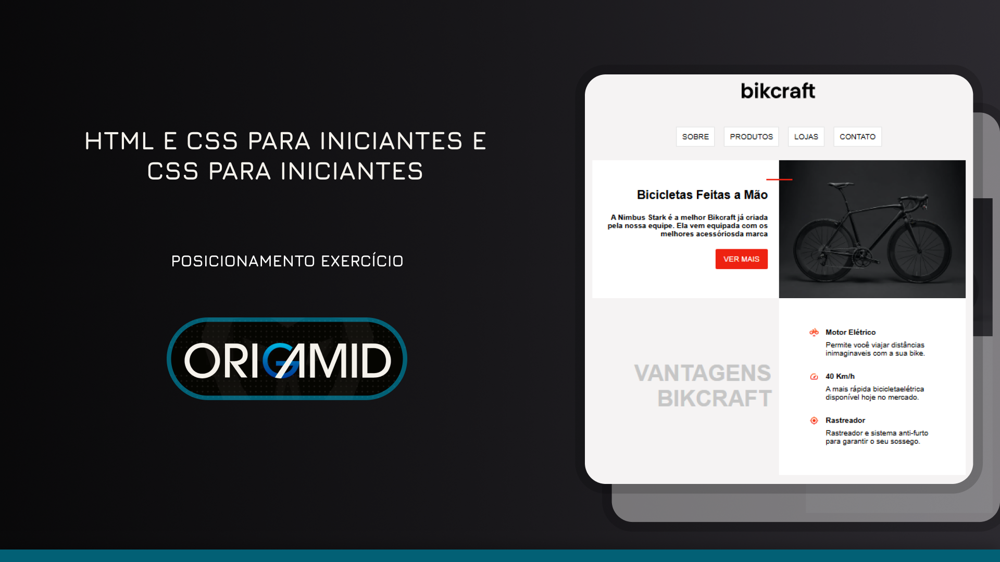
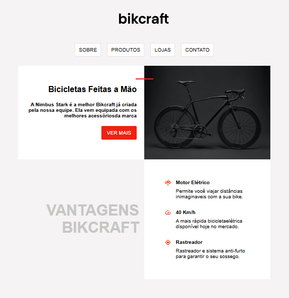

# Projeto Bikcraft - HTML e CSS

Este é um projeto desenvolvido como parte do curso "HTML e CSS para Iniciantes" da [Origamid](https://www.origamid.com/curso/html-e-css-para-iniciantes/0309-posicionamento-exercicio-1).

O projeto consiste em uma página web estática, construída com HTML e CSS, que simula a página de um produto para a marca de bicicletas "Bikcraft". O objetivo principal foi praticar conceitos básicos de estruturação de HTML e estilização com CSS, incluindo posicionamento de elementos e layouts responsivos.

---

### Tecnologias Utilizadas

- **HTML5:** Usado para estruturar o conteúdo da página, incluindo a navegação, a seção do produto e os detalhes.
- **CSS3:** Utilizado para estilizar a página, definir o layout, cores, fontes e o posicionamento dos elementos.

### Estrutura do Projeto

- `index.html`: O arquivo principal que contém a estrutura da página web.
- `style.css`: A folha de estilos que define a aparência da página.
- `assets/`: Diretório contendo as imagens e ícones utilizados no projeto.
  - `assets/icon/`: Contém os ícones em formato SVG.
  - `assets/img/`: Contém a imagem da bicicleta em formato JPG.

### Principais Conceitos CSS Aplicados

- **Box Model:** Uso de `margin`, `padding`, `border` e `box-sizing: border-box` para controlar o espaçamento e o tamanho dos elementos.
- **Flexbox:** Utilizado na navegação (`header nav`) e na descrição do produto (`#description`) para alinhar e distribuir os itens.
- **Grid Layout:** Empregado na seção de detalhes (`#more-details`) e nos cartões de texto (`.text-details`) para criar layouts em colunas de forma eficiente.
- **Variáveis CSS:** As variáveis `--cinza-fundo`, `--cinza-texto` e `--vermelho` foram definidas na pseudo-classe `:root` para gerenciar as cores de forma centralizada e facilitar a manutenção.
- **Posicionamento (Positioning):** Utilização de `position: absolute` para posicionar a linha vermelha (`#line`) sobre a seção do produto.
- **Pseudo-classes e Pseudo-elementos:** A cor de destaque (`--vermelho`) é utilizada para a linha decorativa.

### Como Executar o Projeto

1.  Clone este repositório para sua máquina local.
2.  Abra o arquivo `index.html` em seu navegador web preferido.

---

### Screenshot do Projeto

 Design simples do Exercicio da primeira parte do curso de HTML e CSS para Iniciantes ([Origamid](https://www.origamid.com/curso/html-e-css-para-iniciantes/0309-posicionamento-exercicio-1))

---

### Agradecimentos

Este projeto foi uma etapa de aprendizado do curso de HTML e CSS da Origamid, que me ajudou a solidificar os conhecimentos básicos de desenvolvimento web.
